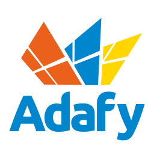

# EPassi plugin for API Framework

Plugin which provides OpenAPI interface to the EPassi lunch report.

## Support

Commercial support is provided by [Adafy](https://adafy.com).

Adafy is a Finnish software development house, focusing on Microsoft technologies.

# More details

- [Adafy](https://adafy.com)
- [API Framework](https://github.com/weikio/apiframework)